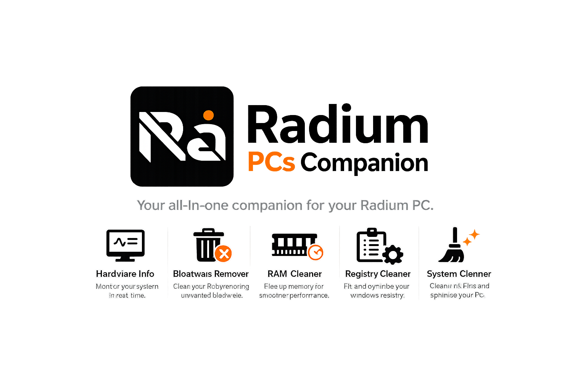
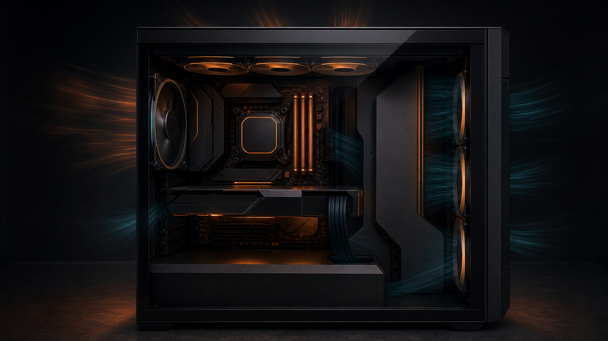

# Radium PCs Companion

<p align="center">
  
</p>

<p align="center">
  <strong>Premium Windows telemetry, diagnostics, and maintenance companion for Radium PCs systems.</strong>
</p>

<p align="center">
  <a href="#quick-start">Quick Start</a> |
  <a href="#what-it-does">What It Does</a> |
  <a href="#architecture">Architecture</a> |
  <a href="#safety-model">Safety Model</a> |
  <a href="#installer-and-distribution">Installer</a>
</p>

<p align="center">
  
  
  
  
</p>

Radium PCs Companion is a desktop-native Windows utility for monitoring, support, and safe maintenance workflows. It combines a premium React interface with a Rust/Tauri backend, vendor telemetry providers, tray controls, diagnostics export, and a bundled low-level sensor sidecar path for hardware that needs deeper package-temperature access.

The product goal is simple: give Radium PCs customers and technicians a polished, local-first control surface that explains what the machine is doing, what telemetry is trusted, and which actions are safe to perform.

## Current Release

| Item | Status |
|---|---|
| Version | `0.1.0-pre` |
| Channel | Controlled public pre-release |
| Platform | Windows 10/11, x64 |
| Shell | Tauri v2 desktop app |
| Frontend | React 19 + TypeScript |
| Backend | Rust command layer + Windows APIs |
| Installer | NSIS, per-machine |
| Primary artifact | `src-tauri/target/release/bundle/nsis/Radium PCs Companion_0.1.0-pre_x64-setup.exe` |

Useful project documents:

| Document | Purpose |
|---|---|
| [Current state](docs/current-state.md) | Short release handoff and operational baseline |
| [Next stages](docs/next-stages.md) | Feature rollout plan and staged implementation notes |
| [Sensor provider plan](docs/radium-sensor-provider.md) | PawnIO, LibreHardwareMonitor, and sidecar strategy |
| [Compatibility matrix](docs/compatibility-matrix.md) | Hardware validation tracking |
| [Telemetry engine](docs/telemetry-engine.md) | Provider model and diagnostics detail |
| [Security readiness](docs/security-readiness.md) | Release signing, safety posture, and pre-distribution checklist |
| [Clean machine test](docs/clean-machine-test.md) | Tester walkthrough criteria for a fresh install |
| [Dual variant log](docs/dual-variant-enhancement-log.md) | Radium and demo variant build split history |

## What It Does

| Experience | Details |
|---|---|
| Live dashboard | CPU, GPU, RAM, network, storage, provider state, system identity, support readiness, active profile, and telemetry freshness strip. |
| Thermal view | Premium case visualisation with component overlays, vendor branding, airflow cues, and truthful unavailable states. |
| Telemetry diagnostics | Provider orchestration, sensor provenance, namespace inventory, capability coverage, sidecar lifecycle with LHM version, and support export. |
| System Passport | Machine identity, motherboard, BIOS, GPU, storage, RAM, support metadata, and Radium Care owner-readiness checklist. |
| Tray control | Live tray metric icon, tooltip, OSD toggle, quick RAM clean, performance/quiet modes, diagnostics export, and exit. |
| Maintenance tools | Bloatware review, registry checks (including unquoted path detection), startup manager, storage cleaner, RAM optimizer with trim coverage, and staged utilities. |
| Performance profiles | Quiet, Balanced, Creator, and Gaming flows with planned-change preview, processor power tuning, timer resolution, and safety-gated native writes. |
| Benchmark capture | Live sensor trust, benchmark result cards, and latest-vs-previous comparison deltas. |
| About and support | Owner support routing, local diagnostics bundle export, action history, and Restore Centre for Registry Cleaner backups. |
| Radium CoPilot (preview) | Offline-first local LLM recommendations, local runtime model discovery, action-history context injection, and optional local chat. |

## Radium CoPilot (Local Preview)

Radium CoPilot is intentionally local-first in the current preview implementation.

Current behaviour:

- Hardware-aware recommendations are generated locally from current system identity and telemetry.
- CoPilot suggests separate model targets for general use and coding use.
- Runtime connectivity is local by default (`http://127.0.0.1:11434`).
- Installed model discovery reads the local runtime tags endpoint (`GET /api/tags`).
- Chat requests are sent to the same local runtime endpoint (`POST /api/chat`).
- A localhost lock mode is enabled by default to prevent accidental remote runtime usage.
- Optional safe context-pack injection provides curated local diagnostics context for better responses.
- Recent local Companion action history is included in the context pack when available, giving CoPilot awareness of recent maintenance, profile changes, and support activity.

Important scope notes:

- The app does not ship or host model binaries itself.
- Model downloads are user-controlled through local runtime commands (for example `ollama pull ...`).
- CoPilot responses are advisory; native write actions remain capability-gated and user-confirmed.

## Product Principles

| Principle | How the app applies it |
|---|---|
| Local first | Telemetry and maintenance actions run locally. No automatic cloud upload. |
| Truthful telemetry | Missing sensors are shown as degraded or driver-required, never fabricated as zero. |
| Support ready | Diagnostics explain provider state, confidence, fallback paths, and exported evidence. |
| Safe by default | Write paths are gated, reversible where possible, and blocked when model safety is unknown. |
| Premium but dense | The UI is polished, compact, and built for repeated technical use rather than marketing pages. |

## Visual System

The interface uses a dark industrial Radium visual language with orange accents, hardware-aware vendor identity, compact cards, and high information density.

<p align="center">
  
</p>

Current visual assets include:

| Asset family | Files |
|---|---|
| Radium brand | `radiumlogo.png`, `radiumheader-new.png`, `radiumcompanion-header.png`, `radiumcompanion-marketing.png` |
| GPU vendors | `nvidia.png`, `amd.png`, `radeon.png`, `intel.png`, `intelarc.png` |
| Motherboard vendors | `asus.png`, `asrock.png`, `msi.png` |
| Thermal presentation | `thermal-chamber-premium.png` |

## Architecture

```text
React UI
  -> typed service layer
  -> Tauri invoke bridge
  -> Rust command handlers
  -> provider orchestration
  -> Windows APIs / vendor SDKs / sidecar probes
```

| Layer | Responsibility |
|---|---|
| React + TypeScript | Shell, pages, charts, settings, diagnostics, OSD, and premium UI composition. |
| Tauri v2 | Desktop windowing, tray integration, IPC, packaging, and Windows app lifecycle. |
| Rust backend | Hardware sampling, diagnostics snapshots, maintenance commands, startup/tray actions, and safety gates. |
| Vendor providers | NVIDIA NVML, AMD ADL2 scaffold, Intel IGCL scaffold, WMI/sysinfo fallback. |
| Sensor sidecar | Headless .NET/LibreHardwareMonitor path for CPU package sensors via bundled PawnIO support. |
| NSIS installer | Per-machine install, resource staging, PawnIO silent install hook, and app packaging. |

## Telemetry Providers

| Channel | Primary source | Fallback / status |
|---|---|---|
| CPU usage and clock | `sysinfo` | Live on validated hosts |
| CPU package temperature | Radium sidecar + LibreHardwareMonitor + PawnIO | WMI ACPI/perf/sysinfo fallback, driver-required when unavailable |
| GPU telemetry | NVIDIA NVML | AMD ADL2 staged, Intel IGCL staged, WMI fallback |
| GPU driver version | NVML `nvmlSystemGetDriverVersion` | WMI driver string fallback |
| GPU update check | NVIDIA GeForce driver API | Degrades quietly when offline or unsupported |
| RAM usage | `sysinfo` | Live |
| Storage usage | `sysinfo` | SMART depth staged |
| Network throughput | `sysinfo` adapter delta | Live |

## Sensor Sidecar And PawnIO

The low-level sensor path is staged as a bundled sidecar:

```text
Radium app
  -> radium-sensor-sidecar-x86_64-pc-windows-msvc.dll
  -> private .NET runtime
  -> LibreHardwareMonitorLib
  -> PawnIO driver support
  -> AMD Zen Tctl/Tdie / package sensor rows where exposed
```

Important current behaviour:

- The NSIS post-install hook runs `PawnIO_setup.exe -install -silent`.
- Runtime sidecar discovery checks `$INSTDIR\binaries`, matching Tauri/NSIS resource staging.
- Diagnostics clearly distinguish `sidecar_not_found`, `no_matching_sensors`, `partial_no_cpu_temp`, and `live`.
- CPU package temperature is only accepted when a real hardware monitor row matches policy.
- The loaded LibreHardwareMonitor library version is reported in the sidecar JSON output, the Rust provider model, and the Telemetry Diagnostics sidecar probe UI. Current reviewed version: `0.9.6`.
- Sidecar build guardrails fail the build if the project reference or staged DLL drifts from the reviewed LHM version.

## Diagnostics And Support

Telemetry Diagnostics is designed for support handoff, not just developer debugging.

It captures:

- active provider and fallback counts,
- sensor provenance and confidence,
- capability registry state,
- WMI namespace availability,
- thermal class inventory,
- GPU adapter inventory,
- GPU engine counter probe state,
- sidecar lifecycle status,
- support readiness notes,
- exportable diagnostics bundle.

Known degraded states are intentionally explicit. For example, systems that do not expose package temperature through user-mode WMI show a driver-required classification instead of a blank or misleading value.

## Safety Model

| Area | Policy |
|---|---|
| Telemetry reads | Allowed when local, low-risk, and provider-backed. |
| Cleanup actions | User initiated, scoped, and presented with visible result state. |
| Performance profiles | Preview first, then apply only supported reversible OS-level changes. |
| Fan/EC/firmware writes | Blocked until model-specific safety validation exists. |
| Driver/provider path | Bundled only from reviewed signed artifacts; release build fails if required PawnIO staging is missing or unsigned. |
| Browser preview | Mock data only. Native actions require Tauri desktop mode. |
| Cloud/network | No automatic telemetry upload. External checks degrade quietly when unavailable. |

Security hardening already in place:

- strict Tauri CSP,
- external URL validation tests,
- hidden subprocess creation for Windows utility flows,
- native/browser split so desktop errors are not silently replaced by mock data,
- startup/tray lifecycle state controlled through explicit settings,
- error boundaries around provider startup and shell rendering.

## Quick Start

```powershell
npm install
npm run check:desktop
npm run desktop
```

## Build

```powershell
npm run build
npm run build:exe
```

Build output:

| Output | Path |
|---|---|
| Frontend bundle | `dist/` |
| Release executable | `src-tauri/target/release/radium_pcs_companion.exe` |
| NSIS installer | `src-tauri/target/release/bundle/nsis/` |

## Installer And Distribution

Primary artifact:

```text
src-tauri/target/release/bundle/nsis/Radium PCs Companion_0.1.0-pre_x64-setup.exe
```

Installer notes:

- NSIS install mode is `perMachine`.
- Bundled resources are staged under the installed `binaries` directory.
- PawnIO is installed silently with `-install -silent`.
- Startup registration uses a current-user Run entry and is reversible from Settings.

Recommended tester flow:

1. Quit any existing tray instance.
2. Install from the NSIS package.
3. Launch Companion and verify tray registration.
4. Open Telemetry Diagnostics and verify provider/degraded-state readability.
5. Export diagnostics and attach the report to issues.
6. Uninstall and verify app removal plus startup entry cleanup.

## Validation Snapshot

Latest local validation in this workspace (2026-06-02):

| Check | Result |
|---|---|
| `npm.cmd run build` | Passed |
| `npm.cmd run check:rust` | Passed |
| `cargo check --manifest-path src-tauri\Cargo.toml` | Passed |
| `cargo test --manifest-path src-tauri\Cargo.toml --lib` | Passed (11 tests) |
| `npm.cmd run build:sensor-sidecar` | Passed; LHM `0.9.6` version verified |
| `npm.cmd run build:exe` | Passed |
| `npm.cmd run build:exe:demo` | Passed |
| `npm.cmd run verify:radium-artifact` | Passed; manifest written to `artifacts/radium/` |
| `npm.cmd run verify:demo-brand-leak` | Passed |
| `npm.cmd run verify:demo-dev-config-restore` | Passed |
| `npm.cmd run test:url-policy` | Passed |

Note: in the sandboxed environment, NuGet access may be blocked while publishing the sensor sidecar. The build script falls back to the existing staged Release sidecar output and still produces the final NSIS installer.

## Hardware Validation

Tracked in [docs/compatibility-matrix.md](docs/compatibility-matrix.md).

Validated during the current phase:

| Host | Result |
|---|---|
| Dell Latitude 5330 | CPU/RAM/network/storage live, Dell CPU package temperature classified as driver-level telemetry required, diagnostics export validated. |
| AMD Ryzen 5 5500 + NVIDIA GTX 1660 SUPER | NVML GPU telemetry live; CPU package temperature depends on sidecar/PawnIO sensor row exposure. |

Pending broader matrix:

- Intel + NVIDIA desktop,
- AMD + NVIDIA desktop,
- AMD + AMD desktop,
- Intel + Intel Arc,
- HP OMEN,
- HP Victus,
- hybrid GPU laptops,
- Intel iGPU-only systems,
- AMD iGPU systems.

## Current Known Limitations

- Some enterprise laptop BIOS profiles do not expose CPU package temperature through user-mode telemetry.
- Intel Arc native telemetry remains staged; fallback channels are surfaced clearly.
- SMART temperature, wear, and TBW channels need deeper per-device `DeviceIoControl` work.
- Fan telemetry writes and EC control remain blocked until model-safe adapters are validated.
- Some installer/uninstaller checks still require interactive validation on tester machines due UAC and Windows shell behaviour.

## Troubleshooting

No telemetry on startup:

- Open Telemetry Diagnostics.
- Check provider state, degraded reasons, and sidecar lifecycle.
- Confirm vendor GPU/chipset drivers are installed.
- Export the diagnostics bundle for support.

CPU temperature unavailable:

- Check whether Diagnostics says `sidecar_not_found`, `no_matching_sensors`, `partial_no_cpu_temp`, or `live`.
- Confirm PawnIO appears in Installed Apps after installation.
- Verify the installed app contains `binaries\radium-sensor-sidecar-x86_64-pc-windows-msvc.dll`.
- If no CPU sensor row is exposed, continue using CPU load and other live channels while the provider policy is tuned for that hardware.

Tray or startup behaviour mismatch:

- Confirm close/minimise/startup toggles in Settings.
- Use the tray menu to restart the monitoring engine.
- Fully exit the tray app before installing a new build.

## Roadmap

Near-term focus:

| Stage | Direction |
|---|---|
| Utilities foundation | Clearer live/staged/planned grouping and safer maintenance copy. |
| Performance profiles | First-class profile workflow with preview/apply confidence. |
| Update surfacing | Quiet version and update indicators in Settings/sidebar. |
| Game mode mappings | Manual app-to-profile mapping before automatic detection. |
| Sensor validation | Improve sidecar diagnostics and hardware matrix coverage. |
| RGB/vendor extras | Keep staged until vendor SDK safety boundaries are clear. |

See [docs/next-stages.md](docs/next-stages.md) for the working implementation plan.

## Scripts

| Script | Purpose |
|---|---|
| `npm run dev` | Browser preview with mock data |
| `npm run desktop` | Tauri desktop app (Radium-branded) |
| `npm run desktop:demo` | Tauri desktop app (neutral demo variant) |
| `npm run build` | Frontend production build |
| `npm run build:exe` | Full Tauri build and NSIS installer (Radium-branded) |
| `npm run build:exe:demo` | Full Tauri build and NSIS installer (neutral demo variant) |
| `npm run build:sensor-sidecar` | Build and stage the .NET sensor sidecar |
| `npm run check:rust` | `cargo check` for the Tauri Rust crate |
| `npm run quality:gate` | Full pre-release quality gate |
| `npm run verify:radium-artifact` | Artifact SHA-256 manifest and brand validation |
| `npm run package:portable` | Portable package script |
| `npm run check:desktop` | Environment prerequisite check |

## Repository Shape

```text
src/                    React UI, pages, components, contexts, services
src-tauri/              Tauri app, Rust backend, packaging, NSIS hooks
tools/radium-sensor-sidecar/
                        Headless .NET sensor sidecar
vendor/                 Reviewed third-party runtime/driver artifacts
images/                 Brand, OEM, and visual presentation assets
docs/                   Architecture, telemetry, roadmap, validation notes
scripts/                Build, audit, and packaging helpers
```
